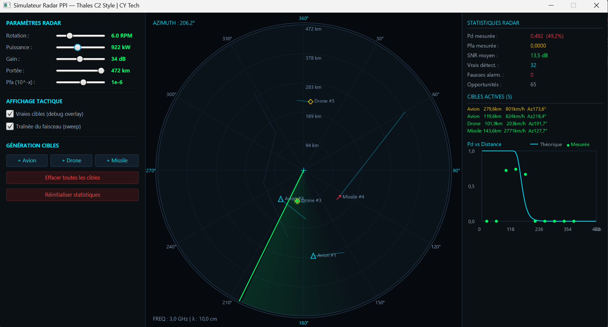

<p align="center">
  
</p>

<h1 align="center">Simulateur Radar PPI & IHM Tactique (C2 / TopSky)</h1>

<p align="center">
  
  
  
  
</p>

<p align="center">
  <b>Mohamed Lemine Ahmed Jeddou</b> — Élève-ingénieur à <i>CY Tech</i> (2026)
</p>

---

## 📸 Aperçu de l'Interface Tactique

> *Interface de contrôle et scope PPI inspirés des radars de surveillance aérienne Thales (GMA400, GM200) et des systèmes de contrôle aérien (TopSky / Command & Control).*

<p align="center">
  
</p>

---

## 🎯 Présentation du Projet

Ce projet est un simulateur en temps réel d'un **Radar de Surveillance Aérienne Type PPI (Plan Position Indicator)** développé en JavaFX. Il combine une **IHM tactique militaire moderne** et une **modélisation physique stricte** du traitement du signal radar (SNR, bruit de mesure, taux de fausse alarme, équations de détection).

### ✨ Fonctionnalités Clés
* **Scope PPI Tactique** : Balayage circulaire 360° avec rémanence/traînée lumineuse, anneaux de portée, grilles d'azimut, boussole d'orientation et fond de carte vectoriel.
* **Symbologie STANAG** : Représentation adaptée selon le type de menace :
   * ✈️ **Avions** : Triangles tactiques orientés avec vecteur vitesse prédictif.
   * 🛸 **Drones / Furtifs** : Losanges de traçage.
   * 🚀 **Missiles** : Flèches d'interception haute vitesse.
* **Statistiques & Courbes Temps Réel** : Suivi dynamique du SNR moyen, comparaison entre la probabilité de détection théorique et mesurée ($P_d = f(\text{Distance})$) et compteurs de fausses alarmes.
* **Commandes Système** : Ajustement à la volée de la puissance émetteur, vitesse de rotation (RPM), gain d'antenne, seuil $P_{fa}$ et portée maximale.

---

## 📐 Physique Implémentée

### 1. Équation Radar Fondamentale (Calcul du SNR)

Le rapport signal sur bruit est calculé pour chaque cible dans le faisceau d'antenne :

$$SNR = \frac{P_t \cdot G^2 \cdot \lambda^2 \cdot \sigma}{(4\pi)^3 \cdot R^4 \cdot k \cdot T \cdot B \cdot F}$$

| Symbole | Signification | Valeur par défaut |
| :--- | :--- | :--- |
| **$P_t$** | Puissance crête | $500\text{ kW}$ |
| **$G$** | Gain antenne | $33\text{ dB}$ |
| **$\lambda$** | Longueur d'onde | $10\text{ cm}$ (Bande S) |
| **$\sigma$** | Section efficace (RCS / SER) | $3\text{ m}^2$ (Avion) |
| **$R$** | Distance cible-radar | Variable ($\text{km}$) |
| **$k$** | Constante de Boltzmann | $1.38 \times 10^{-23}\text{ J/K}$ |
| **$T$** | Température du système | $290\text{ K}$ |
| **$B$** | Bande passante | $1\text{ MHz}$ |
| **$F$** | Facteur de bruit | $5\text{ dB}$ |

---

### 2. Probabilité de Détection ($P_d$) et Bruit

$$P_d = Q\left(Q^{-1}(P_{fa}) - \sqrt{2 \cdot SNR}\right)$$

* **$Q$** : Fonction $Q$ gaussienne (queue de la distribution normale).
* **$P_{fa}$** : Probabilité de fausse alarme ($10^{-6}$ par défaut, configurable).
* **Bruit de mesure (Méthode Box-Muller)** :
   * Erreur en distance : Bruit gaussien ($\sigma = 0.5\%$ de la portée).
   * Erreur en azimut : Bruit gaussien ($\sigma = 0.3^\circ$).

---

## 🎯 Matrice des Cibles Simulées

| Type | RCS ($\text{m}^2$) | Vitesse typique |
| :--- | :--- | :--- |
| **Avion** | $3.0\text{ m}^2$ | $800 \text{ à } 1200\text{ km/h}$ |
| **Drone** | $1.5\text{ m}^2$ | $180 \text{ à } 360\text{ km/h}$ |
| **Missile** | $5.0\text{ m}^2$ | $2500 \text{ à } 3600\text{ km/h}$ |
| **Oiseau / Parasite** | $0.3\text{ m}^2$ | $30 \text{ à } 100\text{ km/h}$ |

---

## 🏗️ Architecture Logicielle (MVC)

```text
src/
├── application/
│   └── Main.java              # Point d'entrée JavaFX (Layout 3 colonnes)
├── controller/
│   └── RadarController.java   # Boucle de simulation temps réel (AnimationTimer)
├── model/
│   ├── Radar.java             # Physique radar (SNR, Pd, Pfa, bruit)
│   ├── Target.java            # Cibles (position, vitesse, RCS)
│   ├── Detection.java         # Résultats de détection et fausses alarmes
│   └── RadarStats.java        # Calculs statistiques et histogramme Pd
└── view/
    ├── RadarDisplay.java      # Canvas du Scope PPI (Rendu vectoriel)
    ├── StatsPanel.java        # Panneau texte & Courbe Pd vs Distance
    └── ControlPanel.java      # Sliders et commandes de simulation


